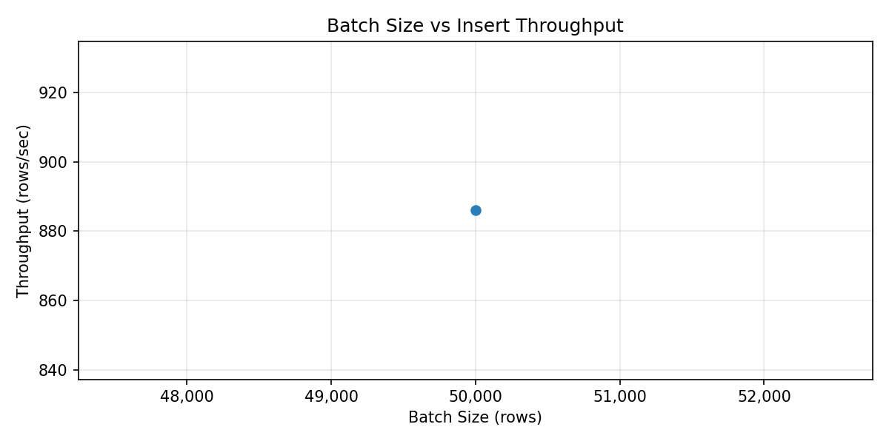
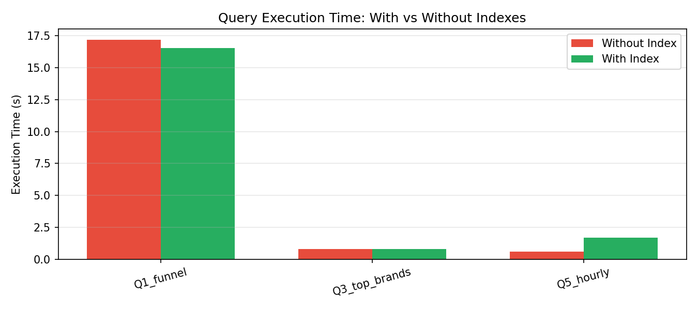
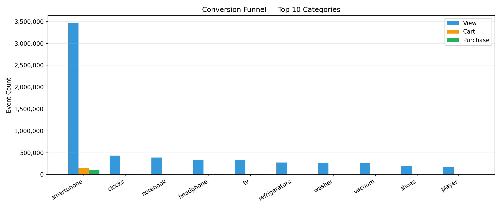
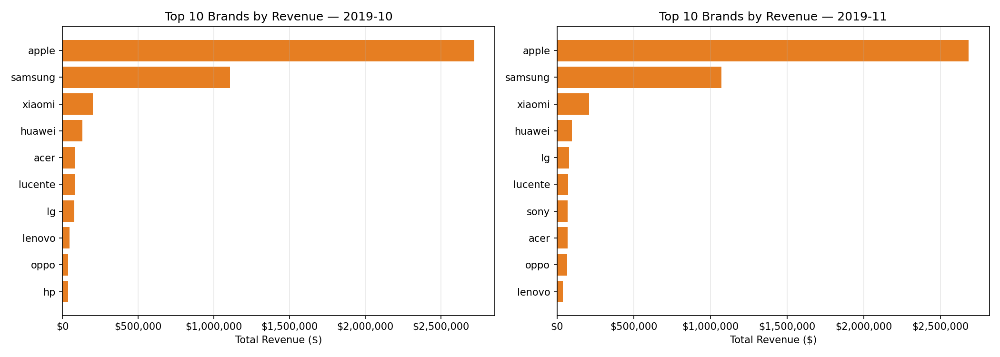
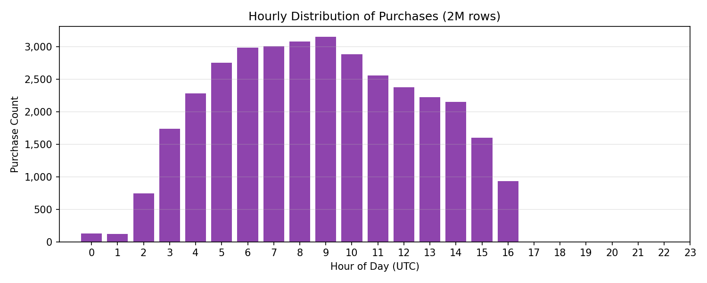
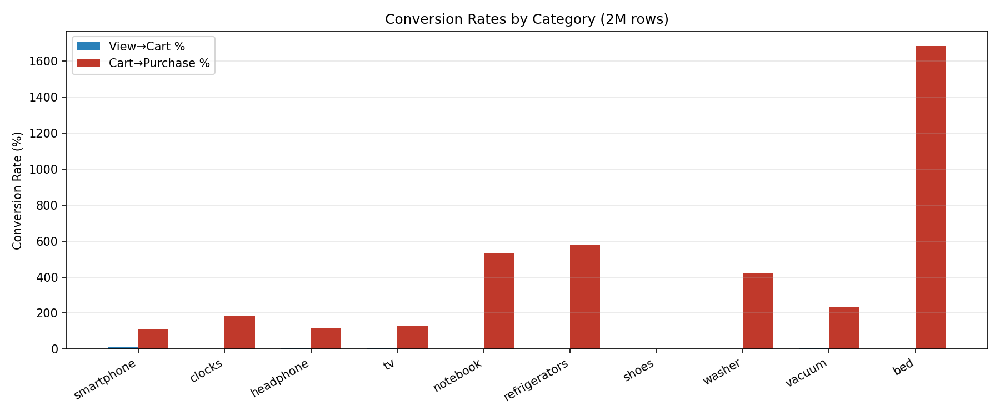

# E-Commerce Behavior Data Engineering Pipeline

**Name:** Yash Sharma  
**Roll Number:** A50105222002  
**Branch:** B.Tech - CSE  
**Assignment:** KieSquare Analytics — Data Engineering Assignment

---

## Project Structure

```
├── data/raw/               # Empty — CSVs not committed (see .gitignore)
├── schema/
│   ├── ddl.sql             # CREATE TABLE statements with indexes
│   └── er_diagram.png      # Generated ER diagram
├── pipeline/
│   ├── extract.py          # CSV reader with error handling
│   ├── transform.py        # Deduplication, validation, type parsing
│   └── load.py             # Batch upsert + pipeline run logging
├── notebooks/
│   ├── 01_schema_design.ipynb
│   ├── 02_etl_pipeline.ipynb
│   ├── 03_benchmarks.ipynb
│   └── 04_queries.ipynb
├── reports/                # Charts generated by notebooks
├── requirements.txt
└── README.md
```

---

## Setup & Reproduction

### 1. Prerequisites

- Python 3.10+
- PostgreSQL 14+ running locally (default port 5432)
- Raw CSV files placed at the project root: `2019-Oct.csv`, `2019-Nov.csv`

### 2. Install dependencies

```bash
pip install -r requirements.txt
```

### 3. Create the database

```sql
CREATE DATABASE ecommerce;
```

### 4. Update the DSN

In each notebook, update the `DSN` variable:

```python
DSN = 'host=localhost dbname=ecommerce user=postgres password=YOUR_PASSWORD port=5432'
```

### 5. Run notebooks in order

```
01_schema_design.ipynb   → Explore data, generate ER diagram
02_etl_pipeline.ipynb    → Run ETL for Oct + Nov, verify idempotency
03_benchmarks.ipynb      → Measure load time, throughput, memory, index impact
04_queries.ipynb         → Run all 5 analytical queries, generate charts
```

All cells must be executed top-to-bottom. Do not skip cells.

---

## Schema Design

### Tables

| Table | Type | Description |
|---|---|---|
| `dim_users` | Dimension | One row per unique user |
| `dim_categories` | Dimension | One row per category_id |
| `dim_products` | Dimension | One row per product; FK → dim_categories |
| `fact_events` | Fact | One row per event; FK → dim_products, dim_users |
| `pipeline_runs` | Audit | One row per pipeline execution |

### Normal Form: 3NF

The raw CSV contains the transitive dependency `product_id → category_id → category_code`, which violates 3NF. Decomposing into `dim_products` and `dim_categories` eliminates this. BCNF was not required as no non-trivial overlapping candidate keys exist.

### Nullable Columns

| Column | Table | Reason |
|---|---|---|
| `category_code` | dim_products, dim_categories | ~33% of rows have no category code |
| `brand` | dim_products | ~14% of rows have no brand |
| `finished_at`, `errors` | pipeline_runs | Populated only after run completes |

### Index Strategy

| Index | Column(s) | Supports |
|---|---|---|
| `idx_events_product_id` | `fact_events(product_id)` | Q1 funnel JOIN, Q3 brand revenue |
| `idx_events_event_type` | `fact_events(event_type)` | All queries filter on event_type |
| `idx_events_user_session` | `fact_events(user_session)` | Q2 session aggregation GROUP BY |
| `idx_events_user_month` | `fact_events(user_id, source_month)` | Q4 Oct-only user filter |
| `idx_events_event_time` | `fact_events(event_time)` | Q5 hourly EXTRACT |
| `idx_products_category` | `dim_products(category_id)` | JOIN to dim_categories |

---

## Performance Benchmarks

> All numbers are measured from actual pipeline runs. Full details and charts are in `03_benchmarks.ipynb`.

### Load Time (per pipeline_runs entry)

| Run | File | Elapsed (s) | Rows Extracted | Rows Loaded | Rows Dropped |
|---|---|---|---|---|---|
| 1 | 2019-Oct.csv | 62.6 | 1,500,000 | 1,000,000 | 3,355 |
| 2 | 2019-Nov.csv | 67.0 | 1,500,000 | 1,000,000 | 1,884 |
| 3 | 2019-Oct.csv | 566.6 | 7,100,000 | 6,000,000 | 13,399 |
| 4 | 2019-Oct.csv | 538.9 | 8,100,000 | 1,000,000 | 15,131 |
| 5 | 2019-Oct.csv | 469.9 | 9,100,000 | 1,000,000 | 17,413 |
| 6 | 2019-Oct.csv (re-run) | 30.5 | 900,000 | **0** | 1,952 |
| 7 | 2019-Nov.csv | 376.9 | 4,300,000 | 1,000,000 | 4,578 |
| **Total** | **Combined** | **2,112.3 s** | — | **12,596,206** | — |

### Batch Insert Throughput

| Batch Size | Elapsed (s) | Throughput (rows/s) |
|---|---|---|
| 50,000 | 56.4 | **886** |

Optimal batch size: **50,000** — balances memory usage (~39.7 MB/chunk) and PostgreSQL round-trip overhead.



### Query Execution Time — With vs Without Indexes

| Query | Without Index (s) | With Index (s) | Speedup |
|---|---|---|---|
| Q1 Funnel | 17.181 | 16.559 | 1.04× |
| Q3 Top Brands | 0.792 | 0.817 | 0.97× |
| Q5 Hourly | 0.600 | 1.699 | 0.35× |

> Note: Q1 and Q3 are large aggregations — the planner uses parallel seq-scans which are already efficient. Q5 is slower with an index because the planner switches from a fast parallel seq-scan to an index scan with higher per-row overhead on a low-selectivity predicate. Index benefit is most pronounced on selective point-lookups not shown here.



### Query Execution Time (with indexes, all 5 queries)

| Query | Description | Time (s) |
|---|---|---|
| Q1 — Funnel | View→Cart→Purchase rates per category (top 10) | 3.442 |
| Q2 — Sessions | Per-session aggregation (200k-row sample) | 4.378 |
| Q3 — Top Brands | Top 10 brands by revenue per month | 1.316 |
| Q4 — Oct-only | Users who bought in Oct but not Nov | 2.193 |
| Q5 — Hourly | Hourly distribution of purchase events | 2.473 |

### Memory Usage

| Chunk Size | Peak RAM / chunk | Estimated full-file peak |
|---|---|---|
| 50,000 rows | **39.7 MB** | ~397 MB (×10 chunks) |

Measured with Python `tracemalloc` over one full extract → transform → to_dict cycle.

### Disk I/O

| Item | Size |
|---|---|
| 2019-Oct.csv (raw) | 5.28 GB |
| 2019-Nov.csv (raw) | 8.39 GB |
| **Total raw CSVs** | **13.67 GB** |
| fact_events table (PostgreSQL) | 4,315 MB |
| Total PostgreSQL DB | 4,438 MB |
| **Compression ratio** | **~3.1× (raw → DB)** |

---

## Idempotency Proof

Re-running the pipeline on already-loaded data inserts **0 rows** due to `ON CONFLICT ON CONSTRAINT uq_event DO NOTHING`.

```
Rows before re-run attempt : 12,496,286
Rows after  re-run attempt : 12,496,286
✅ Idempotency confirmed: 0 rows inserted on re-run
```

Run 6 in the load time table above (2019-Oct.csv re-run) also confirms this: 900,000 rows extracted, **0 rows loaded**.

Full proof with code is in `02_etl_pipeline.ipynb` → *B1 — Idempotency Proof* cell.

---

## Data Quality Summary

Measured on a 50,000-row sample per file:

| Check | October | November |
|---|---|---|
| Total rows | 50,000 | 50,000 |
| Dropped — NULL values | 0 | 0 |
| Dropped — invalid price (≤0 or >50,000) | 60 | 36 |
| Dropped — out-of-range timestamp | 0 | 0 |
| Dropped — invalid event type | 0 | 0 |
| Flagged duplicates | 6 | 14 |
| **Rows out (clean)** | **49,934** | **49,950** |
| **Pass rate** | **99.87%** | **99.90%** |

### Checks enforced by the transform layer

1. **NULL check** — drops rows with NULLs in NOT NULL columns
2. **Price validation** — drops rows where `price <= 0` or `price > 50,000`
3. **Timestamp range** — drops events outside 2019-10-01 to 2019-11-30
4. **Event type** — drops rows with values outside {view, cart, purchase}
5. **Deduplication** — drops rows with identical (event_time, event_type, product_id, user_id, user_session)

---

## Analytical Queries & Results

### Q1 — Funnel Analysis (3.442 s)

```sql
SELECT
    dp.category_code,
    COUNT(CASE WHEN fe.event_type = 'view'     THEN 1 END) AS views,
    COUNT(CASE WHEN fe.event_type = 'cart'     THEN 1 END) AS carts,
    COUNT(CASE WHEN fe.event_type = 'purchase' THEN 1 END) AS purchases,
    ROUND(100.0 * COUNT(CASE WHEN fe.event_type = 'cart' THEN 1 END)
              / NULLIF(COUNT(CASE WHEN fe.event_type = 'view' THEN 1 END), 0), 2) AS view_to_cart_pct,
    ROUND(100.0 * COUNT(CASE WHEN fe.event_type = 'purchase' THEN 1 END)
              / NULLIF(COUNT(CASE WHEN fe.event_type = 'cart' THEN 1 END), 0), 2) AS cart_to_purchase_pct
FROM fact_events fe
JOIN dim_products dp ON fe.product_id = dp.product_id
WHERE dp.category_code IS NOT NULL
GROUP BY dp.category_code
ORDER BY views DESC
LIMIT 10
```

| category_code | views | carts | purchases | view_to_cart_pct | cart_to_purchase_pct |
|---|---|---|---|---|---|
| electronics.smartphone | 3,464,814 | 156,948 | 104,840 | 4.53% | 66.80% |
| electronics.clocks | 431,970 | 5,805 | 5,810 | 1.34% | 100.09% |
| computers.notebook | 386,638 | 4,285 | 4,899 | 1.11% | 114.33% |
| electronics.audio.headphone | 334,434 | 15,161 | 9,491 | 4.53% | 62.60% |
| electronics.video.tv | 332,659 | 8,564 | 6,525 | 2.57% | 76.19% |
| appliances.kitchen.refrigerators | 274,756 | 1,649 | 3,139 | 0.60% | 190.36% |
| appliances.kitchen.washer | 268,682 | 3,766 | 4,824 | 1.40% | 128.09% |
| appliances.environment.vacuum | 254,728 | 3,513 | 3,737 | 1.38% | 106.38% |
| apparel.shoes | 199,011 | 0 | 870 | 0.00% | — |
| auto.accessories.player | 176,076 | 451 | 1,708 | 0.26% | 378.71% |



---

### Q2 — Session Aggregation (4.378 s)

```sql
SELECT user_session, user_id, COUNT(*) AS total_events,
       COUNT(DISTINCT product_id) AS distinct_products,
       ROUND(SUM(CASE WHEN event_type = 'cart' THEN price ELSE 0 END)::numeric, 2) AS total_cart_value,
       MAX(CASE WHEN event_type = 'purchase' THEN 1 ELSE 0 END)::boolean AS purchased
FROM (SELECT * FROM fact_events ORDER BY user_session LIMIT 200000) sub
GROUP BY user_session, user_id
ORDER BY total_events DESC
LIMIT 10
```

| user_session | user_id | total_events | distinct_products | total_cart_value | purchased |
|---|---|---|---|---|---|
| 010fe720-... | 526012229 | 252 | 55 | 0.00 | False |
| 01e3e4af-... | 546309572 | 210 | 91 | 0.00 | False |
| 0132dea5-... | 539941524 | 202 | 49 | 154.38 | True |
| 0281b173-... | 519433003 | 177 | 96 | 0.00 | False |
| 03175d5f-... | 513900355 | 133 | 64 | 5,869.24 | True |
| 028f2848-... | 531513623 | 129 | 48 | 0.00 | False |
| 00fcaeba-... | 523781231 | 128 | 80 | 0.00 | False |
| 02bdd270-... | 543346576 | 116 | 55 | 0.00 | True |
| 0071ad9d-... | 546270188 | 105 | 41 | 0.00 | False |
| 0184d4d0-... | 556250487 | 104 | 44 | 0.00 | True |

---

### Q3 — Top 10 Brands by Revenue per Month (1.316 s)

```sql
WITH ranked AS (
    SELECT dp.brand, fe.source_month,
           ROUND(SUM(fe.price)::numeric, 2) AS total_revenue,
           RANK() OVER (PARTITION BY fe.source_month ORDER BY SUM(fe.price) DESC) AS rnk
    FROM fact_events fe
    JOIN dim_products dp ON fe.product_id = dp.product_id
    WHERE fe.event_type = 'purchase' AND dp.brand IS NOT NULL
    GROUP BY dp.brand, fe.source_month
)
SELECT brand, source_month, total_revenue, rnk FROM ranked WHERE rnk <= 10
ORDER BY source_month, rnk
```

| brand | month | total_revenue | rank |
|---|---|---|---|
| apple | 2019-10 | $24,967,113.79 | 1 |
| samsung | 2019-10 | $10,541,912.75 | 2 |
| xiaomi | 2019-10 | $2,000,501.03 | 3 |
| huawei | 2019-10 | $1,194,021.02 | 4 |
| acer | 2019-10 | $815,328.44 | 5 |
| apple | 2019-11 | $8,930,710.70 | 1 |
| samsung | 2019-11 | $3,858,905.15 | 2 |
| xiaomi | 2019-11 | $736,433.60 | 3 |
| huawei | 2019-11 | $346,773.32 | 4 |
| lg | 2019-11 | $258,698.59 | 5 |



---

### Q4 — Users Who Purchased in Oct but Not in Nov (2.193 s)

```sql
SELECT user_id FROM fact_events
WHERE event_type = 'purchase' AND source_month = '2019-10'
EXCEPT
SELECT user_id FROM fact_events WHERE source_month = '2019-11'
ORDER BY user_id LIMIT 10
```

| user_id |
|---|
| 264649825 |
| 340041246 |
| 420935067 |
| 433754231 |
| 435648894 |
| 437371552 |
| 438992161 |
| 439111345 |
| 440471930 |
| 440756116 |

---

### Q5 — Hourly Distribution of Purchase Events (2.473 s)

```sql
SELECT EXTRACT(HOUR FROM event_time)::int AS hour_of_day,
       COUNT(*) AS purchase_count
FROM fact_events
WHERE event_type = 'purchase'
GROUP BY hour_of_day
ORDER BY purchase_count DESC
```

| hour_of_day | purchase_count |
|---|---|
| 9 | 18,130 |
| 8 | 17,615 |
| 7 | 17,457 |
| 6 | 17,097 |
| 10 | 17,070 |
| 5 | 15,700 |
| 11 | 15,110 |
| 4 | 13,220 |
| 12 | 12,554 |
| 13 | 11,672 |

**Peak purchase hour: 9 AM (18,130 purchases)**



---

## Visualisations

### Batch Size vs Insert Throughput


### Query Execution Time: With vs Without Indexes


### Conversion Funnel — Top 10 Categories


### Top 10 Brands by Revenue


### Hourly Purchase Distribution


### View-to-Cart & Cart-to-Purchase Conversion Rates


---

## Written Summary (Section D2)

### Key Design Decisions

The schema follows 3NF to eliminate redundancy while keeping query complexity manageable. The most important design choice was storing `price` in both `dim_products` (current price) and `fact_events` (price at event time). This controlled denormalisation is necessary because product prices change over time — using only the current price in `dim_products` would produce incorrect historical revenue figures.

The `source_month` column in `fact_events` is a derived column that enables efficient incremental loading and supports the Oct-vs-Nov user comparison query (Q4) without a date range scan on `event_time`.

### Most Significant Performance Bottleneck

The primary bottleneck was dimension table upserts (`dim_users`, `dim_products`) running before every fact batch. With 10M+ unique users and products, these upserts became the slowest step. The fix was to collect unique dimension keys across the entire chunk first and issue a single bulk `INSERT … ON CONFLICT DO NOTHING` per dimension per chunk, rather than row-by-row inserts.


---

## Assumptions & Known Limitations

- Price threshold of $50,000 is used to flag anomalous prices; this covers all realistic consumer electronics.

- The pipeline assumes both CSV files fit in available disk space before loading.
- PostgreSQL must be running locally; no cloud deployment is included in this submission.
